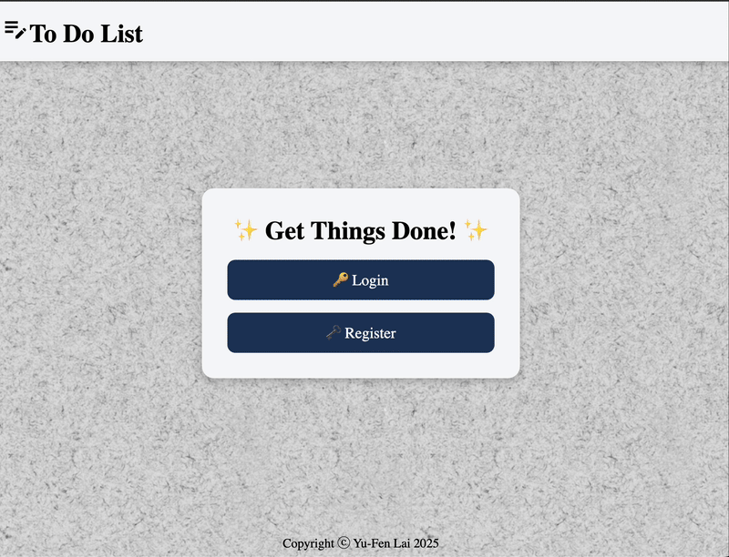

# 📝 To Do List App

This is a **full-stack To Do List application** that enables users to register, log in, and manage their personal tasks securely.


---

## 🚀 Live Demo on Render

https://todolist-frontend-vlgb.onrender.com

---

## 📌 Features

- **Multi-strategy Authentication**

  - Local username/password login (Passport.js + bcrypt)
  - Google OAuth 2.0
  - Internet Identity login (powered by Dfinity)

- **Personal Task Management**

  - View, add, and delete, your own to-do cards after login

- **Session Handling**
  - PostgreSQL-backed session store
  - Cookie settings respect dev/prod environments

---

## 🎥 Live Demos

**Biometric Authentication**

- Using Touch ID as an example



---

## 🛠️ Tech Stack

| Category            | Technology Used                                          |
| ------------------- | -------------------------------------------------------- |
| **Backend**         | Node.js, Express. (ES6)                                  |
| **Frontend**        | React (Vite)                                             |
| **Authentication**  | Passport.js, Google OAuth 2.0, Internet Identity, bcrypt |
| **Database**        | PostgreSQL                                               |
| **Session Store**   | PostgreSQL                                               |
| **Version Control** | Git & GitHub                                             |
| **Deployment**      | Render                                                   |

---

## 💻 Installation & Setup

### Installation

```bash
# Backend setup
cd backend
npm install
npm start

# Frontend setup
cd frontend
npm install
npm run build
```

App runs on http://localhost:5173 and connects to backend API at http://localhost:3000.

### Environment Variables

```bash
# inside frontend folder, create .env file with:
VITE_BACKEND_URL=your_backend_url
VITE_GOOGLE_CLIENT_ID=your_client_id

# inside backend folder, create .env file with:
DATABASE_URL=your_db_url
GOOGLE_CLIENT_ID=your_client_id
GOOGLE_CLIENT_SECRET=your_google_client_secret
GOOGLE_CALLBACK_URL=your_google_cb_url
GOOGLE_CALLBACK_URL_LOCAL=your_google_cb_url_localhost
SESSION_SECRET=your_session_secret
FRONTEND_URL=your_frontend_url
```
